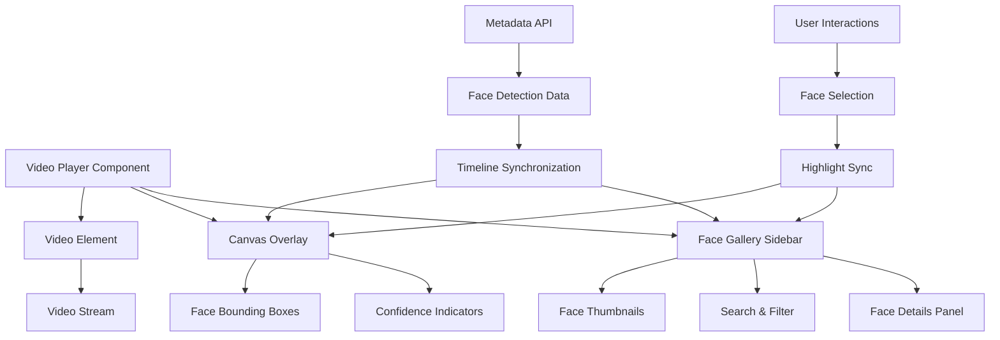

# Design Document

## Overview

The video player face overlay system requires comprehensive fixes to properly display face recognition overlays and a live gallery of detected faces. The current implementation has several issues: face detection data is not loading correctly, overlays are not rendering properly, and the sidebar gallery shows "No faces detected" even when data exists. This design addresses these issues with a robust architecture for real-time face overlay rendering and interactive face gallery functionality.

## Architecture

### System Components



### Data Flow Architecture

1. **Video Selection**: User selects video → Load metadata from API
2. **Metadata Processing**: Parse face detection timeline data → Index by timestamp
3. **Playback Synchronization**: Video time updates → Find matching frame data → Update overlays
4. **Overlay Rendering**: Canvas draws bounding boxes → Color-coded by confidence → Interactive hit detection
5. **Gallery Updates**: Current faces → Thumbnail generation → Search/filter → Selection state

## Components and Interfaces

### 1. Enhanced Video Player Component

**Core Responsibilities:**
- Video playback control and synchronization
- Canvas overlay management with 60fps rendering
- Face gallery sidebar integration
- User interaction handling (hover, click, selection)

**Key Interfaces:**
```typescript
interface VideoPlayerState {
  selectedVideo: Video | null;
  metadata: FaceMetadata | null;
  currentFaces: DetectedFace[];
  selectedFace: DetectedFace | null;
  showOverlay: boolean;
  showSidebar: boolean;
  playing: boolean;
  currentTime: number;
}

interface DetectedFace {
  id: string;
  contestant_id: number;
  contestant_name: string;
  contestant_nickname: string;
  confidence: number;
  bounding_box: BoundingBox;
  timestamp: number;
  interpolated: boolean;
}

interface BoundingBox {
  x: number;
  y: number;
  width: number;
  height: number;
}
```

### 2. Face Overlay Canvas System

**Rendering Pipeline:**
- **Frame Synchronization**: Match video timestamp to metadata timeline
- **Coordinate Scaling**: Scale bounding boxes to canvas dimensions
- **Visual Rendering**: Draw boxes, corners, labels with confidence-based colors
- **Label Display Logic**: Show contestant names above bounding boxes when confidence > 0.7
- **Interactive Layer**: Handle mouse events for face selection

**Confidence-Based Visual Styling:**
- **High Confidence (> 0.7)**: Green bounding boxes (#10b981) with contestant names displayed
- **Medium Confidence (0.5-0.7)**: Orange bounding boxes (#f59e0b) without names
- **Low Confidence (< 0.5)**: Red bounding boxes (#ef4444) without names

**Performance Optimizations:**
- **RequestAnimationFrame**: 60fps rendering loop without stuttering
- **Dirty Region Updates**: Only redraw when faces change
- **Canvas Pooling**: Reuse canvas contexts
- **Debounced Updates**: Prevent excessive redraws during seeking

### 3. Face Gallery Sidebar

**Components:**
- **Face Grid**: Thumbnail view of current faces
- **Search Bar**: Filter faces by contestant name
- **Sort Controls**: Order by confidence or name
- **Face Details Panel**: Detailed information for selected face

**State Management:**
```typescript
interface GalleryState {
  faces: DetectedFace[];
  filteredFaces: DetectedFace[];
  searchQuery: string;
  sortBy: 'confidence' | 'name';
  selectedOnly: boolean;
  selectedFace: DetectedFace | null;
}
```

**Default Behavior:**
- **Face Sorting**: Faces are sorted by confidence score (highest first) by default
- **Empty State**: Display "No faces detected" when no faces are found in current frame
- **Selection State**: Maintain visual selection state between canvas and gallery interactions

### 4. Metadata Loading System

**API Integration:**
- **Endpoint**: `/api/videos/metadata/dense/{videoId}`
- **Data Format**: Dense timeline with frame-level face data
- **Caching**: Browser cache for metadata to improve performance
- **Error Handling**: Graceful fallback when metadata unavailable

**Data Processing:**
```typescript
interface FaceMetadata {
  video_info: {
    filename: string;
    duration: number;
    fps: number;
  };
  processing_info: {
    processing_interval: number;
    interpolation_enabled: boolean;
    total_processed_frames: number;
    total_interpolated_frames: number;
  };
  timeline: TimelineFrame[];
}

interface TimelineFrame {
  frame_number: number;
  timestamp: number;
  contestants: DetectedFace[];
}
```

## Data Models

### Face Detection Data Structure

**Timeline Format:**
```json
{
  "video_info": {
    "filename": "video-1.mp4",
    "duration": 240.5,
    "fps": 30
  },
  "processing_info": {
    "processing_interval": 5,
    "interpolation_enabled": true,
    "total_processed_frames": 1443,
    "total_interpolated_frames": 5772
  },
  "timeline": [
    {
      "frame_number": 0,
      "timestamp": 0.0,
      "contestants": [
        {
          "id": "face_0_0",
          "contestant_id": 1,
          "contestant_name": "張三",
          "contestant_nickname": "小張",
          "confidence": 0.89,
          "bounding_box": {
            "x": 120,
            "y": 80,
            "width": 180,
            "height": 240
          },
          "timestamp": 0.0,
          "interpolated": false
        }
      ]
    }
  ]
}
```

### Contestant Database Integration

**Contestant Mapping:**
```typescript
interface Contestant {
  id: number;
  name: string;
  nickname: string;
  age: number;
  photo_url: string;
}
```

**Data Source**: `/metadata/contestant_info.csv` (編號,姓名,暱稱,年齡)

## Error Handling

### Metadata Loading Errors

**Scenarios:**
1. **Network Failure**: API endpoint unreachable
2. **Missing Metadata**: Video processed but no face data
3. **Corrupted Data**: Invalid JSON or missing fields
4. **Version Mismatch**: Metadata format incompatible

**Error Recovery:**
```typescript
async function loadMetadata(videoId: string): Promise<FaceMetadata | null> {
  try {
    const response = await fetch(`/api/videos/metadata/dense/${videoId}`);
    if (!response.ok) {
      throw new Error(`HTTP ${response.status}: ${response.statusText}`);
    }
    
    const metadata = await response.json();
    validateMetadata(metadata);
    return metadata;
  } catch (error) {
    console.error('Metadata loading failed:', error);
    
    // Fallback to mock data for development
    if (isDevelopment()) {
      return generateMockMetadata(videoId);
    }
    
    // Show user-friendly error
    showErrorMessage('Face recognition data unavailable for this video');
    return null;
  }
}
```

### Canvas Rendering Errors

**Error Scenarios:**
- Canvas context unavailable
- Video dimensions not ready
- Invalid bounding box coordinates
- Memory allocation failures

**Graceful Degradation:**
- Disable overlay rendering if canvas fails
- Show static thumbnails if dynamic rendering fails
- Maintain video playback even if face features break

### User Experience Errors

**Feedback Mechanisms:**
- Loading states during metadata fetch
- Error messages for failed operations
- Retry buttons for recoverable errors
- Fallback content when features unavailable

## Testing Strategy

### Unit Testing

**Canvas Rendering Tests:**
```typescript
describe('Face Overlay Canvas', () => {
  test('should scale bounding boxes correctly', () => {
    const canvas = createMockCanvas(1920, 1080);
    const face = createMockFace({ x: 100, y: 100, width: 200, height: 300 });
    
    const scaledBox = scaleBoundingBox(face.bounding_box, canvas);
    
    expect(scaledBox.x).toBe(100);
    expect(scaledBox.width).toBe(200);
  });
  
  test('should render confidence colors correctly', () => {
    expect(getConfidenceColor(0.9)).toBe('#10b981'); // Green
    expect(getConfidenceColor(0.7)).toBe('#f59e0b'); // Orange  
    expect(getConfidenceColor(0.4)).toBe('#ef4444'); // Red
  });
});
```

**Metadata Processing Tests:**
```typescript
describe('Metadata Processing', () => {
  test('should find faces for current timestamp', () => {
    const metadata = createMockMetadata();
    const faces = findFacesAtTimestamp(metadata, 15.5);
    
    expect(faces).toHaveLength(2);
    expect(faces[0].contestant_name).toBe('張三');
  });
  
  test('should handle interpolated frames', () => {
    const metadata = createMockMetadata();
    const faces = findFacesAtTimestamp(metadata, 12.3);
    
    expect(faces[0].interpolated).toBe(true);
    expect(faces[0].confidence).toBeLessThan(0.9);
  });
});
```

### Integration Testing

**Video Player Integration:**
```typescript
describe('Video Player Integration', () => {
  test('should synchronize overlays with video playback', async () => {
    const { videoElement, canvas } = renderVideoPlayer();
    
    // Simulate video time update
    videoElement.currentTime = 30.0;
    videoElement.dispatchEvent(new Event('timeupdate'));
    
    await waitFor(() => {
      expect(canvas.getContext('2d').strokeRect).toHaveBeenCalled();
    });
  });
  
  test('should update gallery when faces change', async () => {
    const { component } = renderVideoPlayer();
    
    // Simulate time change with different faces
    await component.updateTime(45.0);
    
    expect(screen.getByText('3 faces detected')).toBeInTheDocument();
  });
});
```

### End-to-End Testing

**User Workflow Tests:**
```typescript
describe('Face Recognition Workflow', () => {
  test('should display face overlays during video playback', async () => {
    await page.goto('/video-player');
    
    // Select video
    await page.selectOption('[data-testid=video-select]', 'video-1');
    
    // Play video
    await page.click('[data-testid=play-button]');
    
    // Verify overlays appear
    await expect(page.locator('canvas.face-overlay')).toBeVisible();
    await expect(page.locator('.face-card')).toHaveCount(2);
  });
  
  test('should allow face selection and highlighting', async () => {
    await page.goto('/video-player');
    
    // Click on face in gallery
    await page.click('.face-card:first-child');
    
    // Verify face is selected
    await expect(page.locator('.face-card.selected')).toHaveCount(1);
    await expect(page.locator('.face-details-panel')).toBeVisible();
  });
});
```

### Performance Testing

**Rendering Performance:**
- Canvas rendering should maintain 60fps during playback
- Memory usage should remain stable during long playback sessions
- Face detection updates should not cause frame drops

**Load Testing:**
- Multiple concurrent video players
- Large metadata files (1000+ faces)
- High-resolution video scaling

## Implementation Priorities

### Phase 1: Core Functionality (High Priority)

1. **Fix Metadata Loading**
   - Implement proper API endpoint for dense metadata
   - Add error handling and fallback mechanisms
   - Validate data format and structure

2. **Canvas Overlay Rendering**
   - Implement 60fps rendering loop
   - Add bounding box drawing with confidence colors
   - Implement coordinate scaling for different video sizes

3. **Basic Gallery Functionality**
   - Display current faces in sidebar
   - Show face thumbnails and basic information
   - Implement face selection

### Phase 2: Enhanced Features (Medium Priority)

1. **Interactive Features**
   - Hover effects and highlighting
   - Click-to-select functionality
   - Synchronized selection between video and gallery

2. **Search and Filtering**
   - Text search by contestant name
   - Confidence level filtering
   - Sort by various criteria

3. **Performance Optimization**
   - Implement canvas pooling
   - Add debounced updates
   - Optimize rendering pipeline

### Phase 3: Advanced Features (Low Priority)

1. **Advanced Visualizations**
   - Confidence heat maps
   - Timeline visualization
   - Face tracking paths

2. **Export and Sharing**
   - Screenshot capture with overlays
   - Video clip extraction
   - Share specific timestamps

3. **Accessibility**
   - Keyboard navigation
   - Screen reader support
   - High contrast mode

## Technical Considerations

### Browser Compatibility

**Canvas Support:**
- Modern browsers with HTML5 Canvas API
- Hardware acceleration for smooth rendering
- Fallback for older browsers without canvas support

**Video Support:**
- MP4 format with H.264 codec
- Range request support for streaming
- Cross-origin resource sharing (CORS) configuration

### Performance Optimization

**Memory Management:**
- Proper cleanup of canvas contexts
- Garbage collection of unused face data
- Efficient data structures for timeline indexing

**Rendering Optimization:**
- Use requestAnimationFrame for smooth animation
- Implement dirty region updates
- Cache scaled coordinates to avoid recalculation

### Security Considerations

**Data Validation:**
- Sanitize metadata input to prevent XSS
- Validate bounding box coordinates
- Implement proper error boundaries

**Privacy:**
- No sensitive data in client-side code
- Secure API endpoints for metadata access
- Proper handling of contestant information

This design provides a comprehensive solution for fixing the video player face overlay system while ensuring scalability, performance, and maintainability.